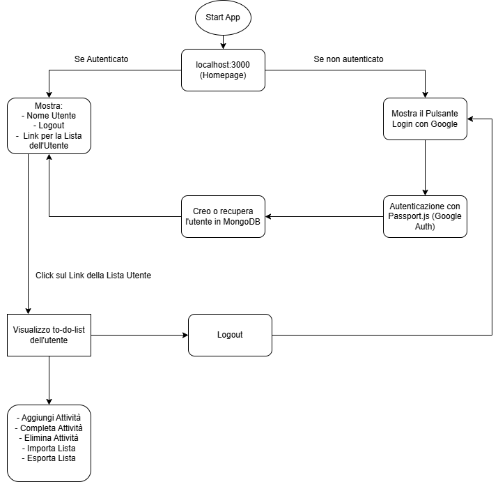

# TO-DO-LIST Google-OAuth-2.0 - Giuseppe Palumbo

## Introduzione:
La seguente applicazione web permette di creare, scaricare e importare una lista con la possibilità di aggiungere o eliminare elementi. I dati della lista vengono salvati in un database MongoDB, il che garantisce la persistenza dei dati tra sessioni e dispositivi diversi.
 

 
Per accedere alla web app, è necessario autenticarsi tramite Google OAuth 2.0.
L'applicazione è sviluppata con Node.js e utilizza Passport.js per gestire il login federato con Google.

---

:spiral_notepad: **Flusso di Autenticazione con Google OAuth 2.0:**
1. L'utente clicca su "Login con Google".
2. Passport.js reindirizza l'utente al server di Google per l'autenticazione OAuth.
3. Google autentica l'utente e reindirizza al callbackURL con un authorization code.
4. Passport.js scambia il codice con un access token e un ID token.
5. Passport.js recupera il profilo dell'utente e lo salva nel database.
6. L'utente autenticato può ora accedere alle funzionalità dell'applicazione.

---

🧑‍💻 **Ambienti Utilizzati:**
- WSL Ubuntu             # Permette di eseguire un ambiente Linux su Windows
- Visual Studio Code     # Editor di codice leggero e potente
- Docker                 # Crea e gestisce container per eseguire applicazioni in ambienti isolati

---

🛠️ **Tecnologie utilizzate:**
- Node.js: Ambiente runtime per l'esecuzione del codice JavaScript.
- Express.js:  Framework web per gestire le route e costruire API RESTful.
- Passport.js: Middleware di autenticazione che supporta diversi tipi di autenticazione come OAuth 2.0.
- Google OAuth 2.0 API: Protocollo per il login federato con Google come provider.
- Express-Session: Middleware per la gestione delle sessioni che ad ogni richiesta controlla la scadenza della sessione.
- MongoDB: Database NoSQL per la memorizzazione persistente dei dati.
- Mongoose: Libreria ODM (Object Data Modeling) per MongoDB, utilizzata per la gestione delle operazioni sul database.

---

📂 **Struttura del progetto:**
```
to-do-list-google-oauth-2.0/
├── src/				# Contiene il codice sorgente principale
│   ├── app.js           # Configurazione Express, gestione delle rotte principali (Auth) e avvio del server
├── views/				# Contiene i file dei template HTML/EJS per il rendering lato server
│   ├── index.ejs        # Pagina principale con accesso e interfaccia utente
│   ├── todo.ejs         # Pagina per la gestione della lista To-Do dell'utente
├── config/				# Contiene i file di configurazione dell'applicazione
│   └── passport.js      # Configurazione di Passport.js per l'autenticazione con Google OAuth 2.0
├── models/				# Contiene i modelli Mongoose per la gestione dei dati
│   └── User.js          # Modello Mongoose per gli utenti, gestisce ID Google, email e altri dati
├── route/				# Contiene i file delle rotte per organizzare meglio il codice
│   └── todoRoutes.js    # Gestisce le rotte relative alla lista To-Do
├── .env                # Variabili d'ambiente per la configurazione dell'app (es. MongoDB URI, API keys)
├── .gitignore          # Esclude file sensibili e cartelle non necessarie dal repository Git
├── package.json        # File di configurazione NPM con le dipendenze del progetto
├── package-lock.json   # Blocca le versioni esatte delle dipendenze installate
└── README.md           # Documentazione del progetto con istruzioni per l'installazione e l'uso
```
---

📊 **Flowchart:**  
  


---
📘 **Rotte principali:**  
**Rotte di Autenticazione (Auth)**
| Metodo        | Percorso              | Descrizione |
| ------------- | -------------         | ----------- |
| GET           | /                     | Home page   |
| GET           | /auth/google          | Avvia l'autenticazione con Google |
| GET           | /auth/google/callback | Callback dopo l'autenticazione |
| POST          | /logout               | Effettua il logout dell'utente |
  
**Rotte per la Gestione delle Attività (Todo)**  
| Metodo        | Percorso              | Descrizione |
| ------------- | -------------         | ----------- |
| GET           | /todo                 | Mostra la lista delle attività dell'utente |
| POST          | /todo/add             | Aggiunge una nuova attività alla lista |
| POST          | /todo/complete        | Marca come "completata" un'attività |
| POST          | /todo/delete          | Elimina un'attività dalla lista |
| GET           | /todo/export          | Esporta la lista delle attività in formato JSON |
| POST          | /todo/import          | Importa una lista di attività da un file JSON   |

---

:gear: **Prerequisiti:**
- Node.js (v14 o successiva)
- NPM
- Un account su [Google Cloud Console](https://console.cloud.google.com/).
- Docker (per eseguire MongoDB tramite container)

---

📦 **Installazione delle dipendenze:**
```
npm init -y                     # Inizializza un nuovo progetto Node.js con le impostazioni predefinite creando automaticamente un file package.json
npm install express passport passport-google-oauth20 dotenv ejs  # Installa Express (server), Passport (autenticazione), Google OAuth, dotenv (variabili ambiente) ed EJS (template engine)  
npm install express             # Installa Express.js (server web)  
npm install express-session     # Installa express-session (gestione delle sessioni)  
npm install mongoose            # Installa Mongoose (gestione database MongoDB)  
npm install multer              # Installa Multer (gestione upload di file)
```
---

🔧 **Configurazione delle variabili d'ambiente**:  
In un file .env aggiungere le seguenti entry:
```
PORT=3000                                       # Porta su cui gira il server Express
GOOGLE_CLIENT_ID=<Client-ID>                    # ID client di Google OAuth 2.0
GOOGLE_CLIENT_SECRET=<Client-Secret>            # Secret client di Google OAuth 2.0
SESSION_SECRET=<Un-segreto-casuale>             # Chiave segreta per la gestione delle sessioni
MONGODB_URI=mongodb://localhost:27017/todolist  # URI per connettersi al database MongoDB locale
DB_USER=<Il-tuo-username-db>                    # Username Database Mongo
DB_PASS=<La-tua-password-db>                    # Password Database Mongo
```
---

📂 **File ignorati:** (.gitignore)
- node_modules/             # Cartella dei pacchetti Node.js (non serve nel repo, si installa con npm install)
- .env                      # File delle variabili d'ambiente
- package.json              # File di configurazione NPM con le dipendenze del progetto (può essere ricreato con npm install)
- package-lock.json         # Blocca le versioni esatte delle dipendenze installate (può essere ricreato con npm install)
- data/                     # Volume montato con Docker per salvare i dati del database

---

📜 **Creazione Account Google:**  
Operazioni principali:
- Creazione di un progetto su Google Cloud.
- Abilitazione dell'API.
- Generazione delle credenziali OAuth 2.0 (Client ID e Client Secret) per un applicazione web.
- Configurazione dei Redirect URI, includendo http://localhost:3000/auth/google/callback


---
☸️ **Avvio MongoDB su container docker e creazione utente todo:**  
Avviare i container con il seguente comando: 
``` 
 docker run -d -p 27017:27017 --name mongodb -v /your/local/path:/data/db mongo
``` 
Se il database non esiste, MongoDB lo creerà automaticamente quando ci sarà il primo inserimento di dati.    
  
Per vedere i dati del db dal container mi posso connettere direttamente al container e lanciare i comandi dopo aver ottenuto la shell di mongo (mongosh):  
```
docker exec -it <nome_o_id_del_container> bash //Per entrare nel container
mongosh //Per ottenere shell mongo
show dbs;  // Mostra i database disponibili
use todolist  // Passa al database 'todolist'
db.users.find();  // Esegui una query su una collezione, in questo caso 'users'
```  

Creazione dell'utente **todo** che verrà usato dall'applicazione per connettersi al DB todolist e avrà permessi di lettura e scrittura sul DB todolist:
```
docker exec -it <nome_o_id_del_container> bash //Per entrare nel container
mongosh //Per ottenere shell mongo
use admin; // Per entrare nel database admin

// Crea un utente per il database todolist con permessi di lettura  e scrittura
db.createUser({
  user: "myUser",   // Nome utente
  pwd: "myPassword", // Password
  roles: [ { role: "readWrite", db: "todolist" } ]
})
``` 
---

:rocket: **Come avviare l'applicazione:**  
Da terminale, lanciare: **node src/app.js**

---

👮‍♂️ **Problemi di Sicurezza Rilevati e Soluzioni:**  

⚠️ **Problemi di Sicurezza:**
- **Man-in-the-Middle (MITM):** L'assenza di HTTPS espone le comunicazioni, inclusi i token OAuth, a potenziali intercettazioni.
- **Replay Attack:** OAuth 2.0, utilizzato da Passport.js, offre protezione contro attacchi di tipo replay grazie a token temporanei e autorizzazioni basate su scope. Tuttavia, senza gestione delle sessioni e revoca dei token, un token compromesso potrebbe essere riutilizzato.
- **Session Hijacking:** Senza una corretta configurazione dei cookie di sessione (HttpOnly, Secure, SameSite), questi possono essere vulnerabili a furti tramite XSS o intercettazioni di rete.
- **File Upload Vulnerabilities:** Un attaccante potrebbe caricare un file dannoso (es. script, eseguibili) per compromettere il sistema.
- **Database Security:** Se il database non è protetto correttamente, può essere esposto a rischi di accesso non autorizzato e data breaches.

✅ **Soluzioni Implementate:**
- **Man-in-the-Middle:** NON implementato poichè è usato in locale. Andrebbe generato un certificato ed esposto in HTTPS.
- **Replay Attack:** Implementata una durata breve per i token e revoca automatica dopo il logout. File: app.js, config/passport.js
- **Session Hijacking:** Configurati i cookie di sessione con i flag HttpOnly, Secure, SameSite e impostata una durata limitata per le sessioni. File: app.js
- **File Upload Vulnerabilities:** Verifica il tipo di file (solo .json) e utilizza una libreria per validare il contenuto del file prima di processarlo. File: todoRoutes.js (Gestione dei file importati)
- **Database Security:** Usare variabili d'ambiente per memorizzare le credenziali di accesso e proteggere il database da accessi esterni non autorizzati. File: app.js, .env
